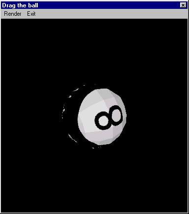



## D3D 8 Ball

### Description

It displays a 3D Sphere in a window , but the nice thing is that it A) uses little code and RAM

B) It is a good program to help ppl understand direct 3D

C) The Sphere is nice "Draggable"

Ofcourse , you need DirectX7 at least
 
### More Info
 

             |
---                |---
**Submitted On**   |2001-01-12 14:15:50
**By**             |[NorthernLight](https://github.com/Planet-Source-Code/PSCIndex/blob/master/ByAuthor/northernlight.md)
**Level**          |Intermediate
**User Rating**    |4.0 (20 globes from 5 users)
**Compatibility**  |VB 5\.0, VB 6\.0
**Category**       |[DirectX](https://github.com/Planet-Source-Code/PSCIndex/blob/master/ByCategory/directx__1-44.md)
**World**          |[Visual Basic](https://github.com/Planet-Source-Code/PSCIndex/blob/master/ByWorld/visual-basic.md)
**Archive File**   |[CODE\_UPLOAD137051122001\.zip](https://github.com/Planet-Source-Code/northernlight-d3d-8-ball__1-14367/archive/master.zip)

